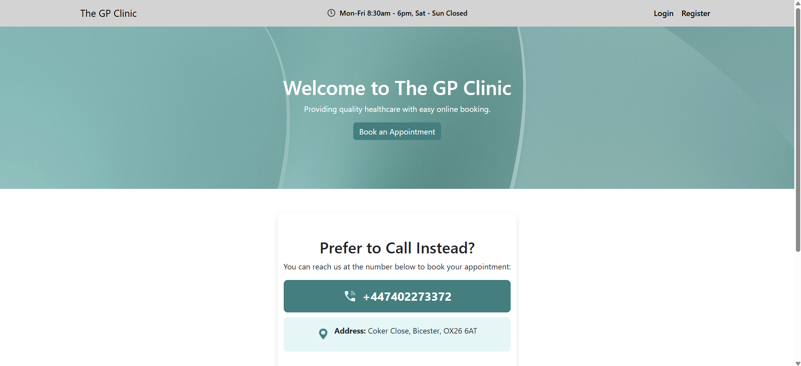
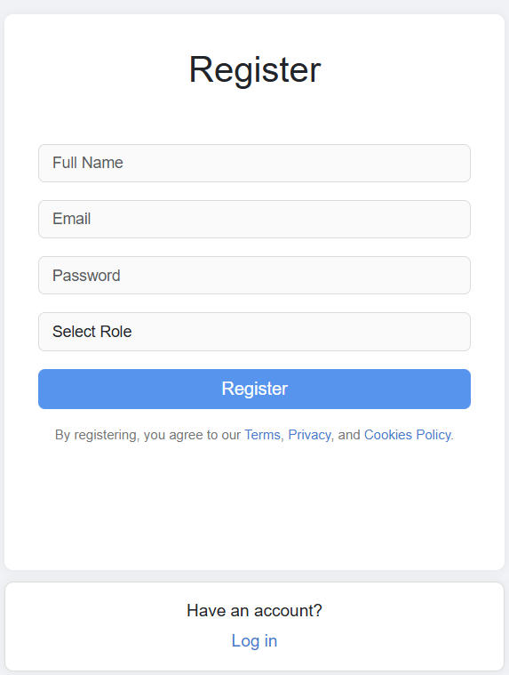
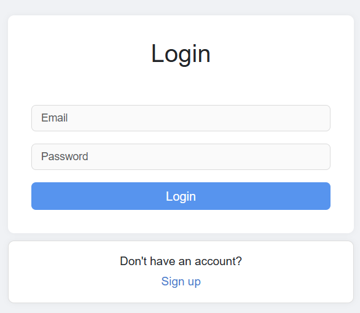
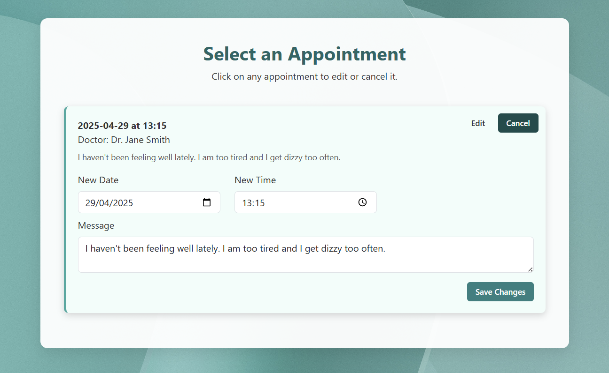
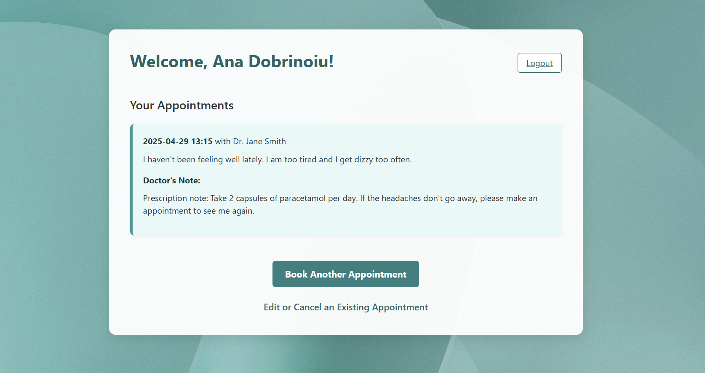
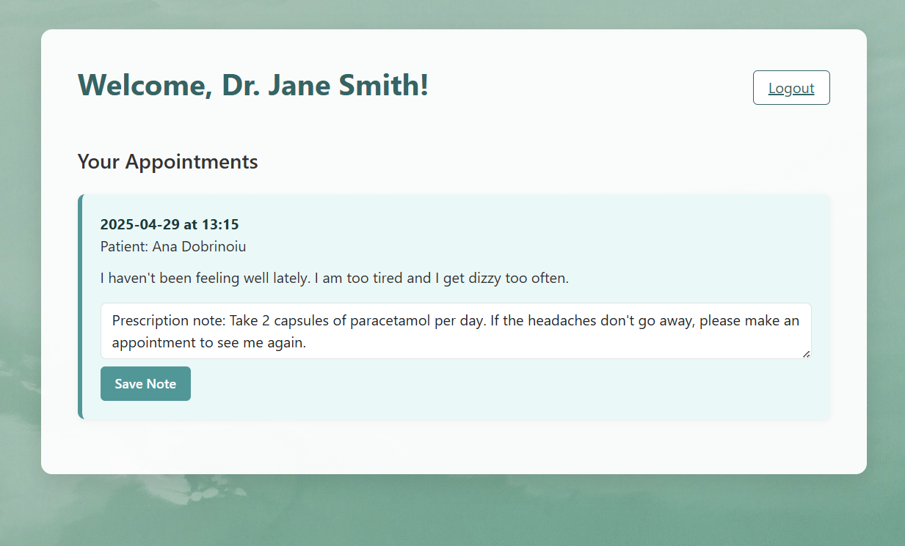
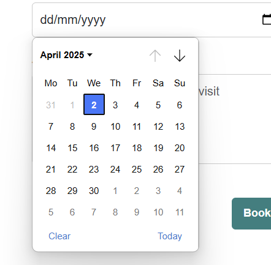

# GP Appointment Booking System

## Overview

This project was developed as part of my BSc Computer Science dissertation at Oxford Brookes University.

The aim of the project was to create a lightweight web-based GP appointment booking platform that allows patients to schedule appointments online while enabling doctors to manage their schedules more efficiently.

The system was inspired by the challenges faced by rural healthcare practices where appointment booking is often handled manually through phone calls, resulting in long waiting times and increased administrative workload.

---

## Features

### Patient Features

- User registration and login
- Book GP appointments online
- View upcoming appointments
- View appointment history
- Edit appointments
- Cancel appointments
- Receive email confirmation after booking

### Doctor Features

- Secure login
- View personal appointment schedule
- Access patient appointment information
- Add notes for patients
- Manage appointments efficiently

---

## Technologies Used

- Python
- Flask
- SQLite
- HTML5
- CSS3
- JavaScript

---

## Key Functionality

- User authentication system
- Role-based access (Patient / Doctor)
- Appointment booking and management
- Appointment conflict detection
- Email notifications
- Responsive mobile-friendly design
- SQLite database integration

---

## Screenshots

### Homepage



### Registration Page



### Login Page



### Appointment Booking



### Patient Dashboard



### Doctor Dashboard



### Calendar View



---

## Project Structure

```text
GP-Web/
│
├── app.py
├── requirements.txt
├── schema.sql
├── Procfile
│
├── templates/
│   ├── index.html
│   ├── login.html
│   ├── register.html
│   ├── appointments.html
│   ├── dashboard.html
│   ├── doctor_dashboard.html
│   └── edit_cancel_menu.html
│
├── static/
│   ├── style.css
│   ├── appointments.css
│   ├── script.js
│   └── images/
│
└── screenshots/
```

---

## Academic Context

This project was completed as part of the BSc Computer Science programme at Oxford Brookes University.

Dissertation Title:

**"From Waiting Rooms to Web Forms: A User-Centred GP Appointment System for Rural Healthcare"**

---

## Author

**Ana Dobrinoiu**

BSc Computer Science  
Oxford Brookes University
